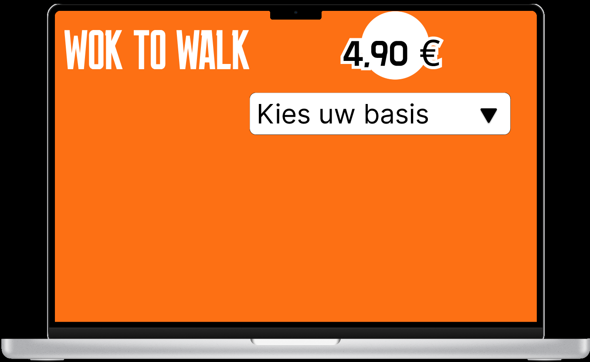
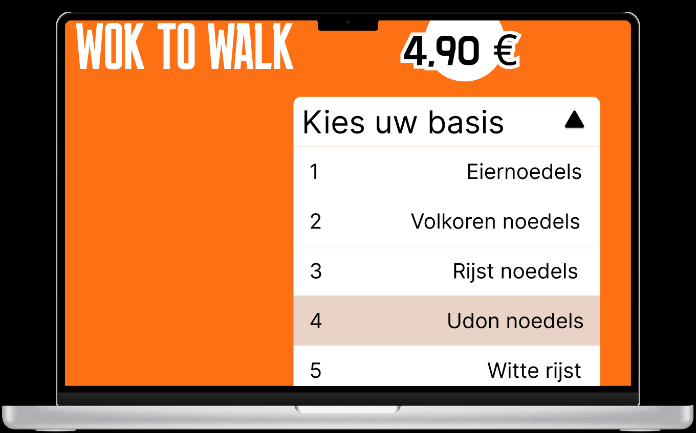

# Model

Het staat model voor digitale tuintjes welke bij 'Het web is voor iedereen' door studenten worden gemaakt.

# Learning Log

### Maandag 31 aug - Kickoff

Een fork van de model repository gemaakt en gepubliceerd via mijn eigen Github omgeving.

## Checkout

### Leg uit wat een source hosting platform is en voor welke jij gekozen hebt.

Een source hosting platform is een platform waar je codes die je hebt geschreven kan bewaren en delen met de community. Ik heb gekozen voor Github

### Vertel welke domeinnaam jij gekozen hebt en hoe je die hebt gekoppeld aan jouw pagina.

Ik heb de naam JJK-Enterprise gekozen omdat die nog beschikbaar was en ik heb die gekoppeld door via github de domein naam met DNS te valideren alleen is het nog niet gelukt.

### Beschrijf hoe je aanpassingen aan jouw pagina kunt maken en hoe je er voor zorgt dat die op het web gepubliceerd worden.

Ik kan aanpassingen maken aan mijn pagina via VSCodium omdat ik via de github de https link heb gecloned aan de VSCodium en daarna synchronized.

## Woensdag 2 sept

Ik heb een begin gemaakt van de wok-to-walk op figma door na te denken welke stappen je moet doorlopen als je een men u digitaal maakt.

## Deepdive -

We hebben een schetscursus gehad waar we leren om rechte lijnen te schetsen zonder liniaal en vierkanten te tekenen en een grid te maken. om uiteindelijk een wireframe te maken die de animaties laat zien

## Vrijdag 4 sept

## Maandag 7 sept

## Woensdag 9 sept

## Checkout

#### Leg uit wat een digital garden is en waarom dat anders is dan een reguliere website.

De digital garden is een website waar je je eigen ideeën kan publiceren en door andere kan laten bekritiseren. En daarmee beetje bij beetje steeds beter te maken of meer uit te proberen. en bij een reguliere website hoort het al compleet aangeleverd te zijn en is minder open voor kritiek.

#### Leg uit wat een website 'webby' maakt en welke websites jou het meeste inspireren.

Een website is 'webby' wanneer het voldoet aan de volgende eisen: Fluïde, adaptief, interactief/dynamisch, toegankelijk, volwassen, expressief, leuk/verassend.
Bij mij inspireert een website het meest als ze interactief, expressief en verassend is.

#### Vertel waar jij mee aan de slag wilt gaan bij het maken van jouw eigen digital garden (let op: dit zijn jouw eerste ideeën, dit kan en mag veranderen in de loop van het programma.

Ik wil aan de slag gaan met films. En specifiek over films die me fascineren en inspireren.

## Vrijdag 11 sept
